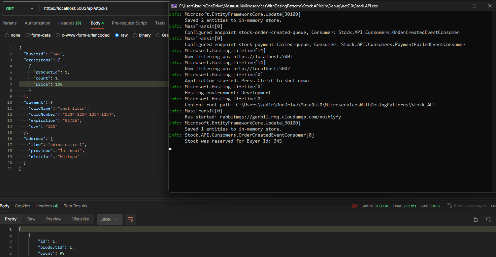
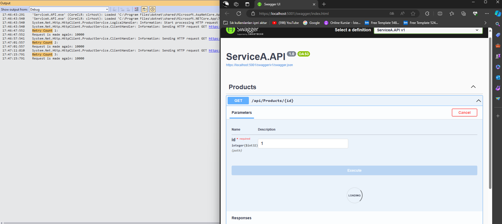

>### Saga Patterns :

>>[SagaChoreography Pattern](https://github.com/LcnKadir/MicroservicesWithDesingPatterns/tree/SagaChoreographyPattern) 

>>[SagaOrchestration Pattern](https://github.com/LcnKadir/MicroservicesWithDesingPatterns/tree/SagaOrchestrationPattern) 

---

>### [Event Sourcing Pattern + CQRS + Docker](https://github.com/LcnKadir/MicroservicesWithDesingPatterns/tree/EventSourcingPattern)

----

>### [Retry Pattern](https://github.com/LcnKadir/MicroservicesWithDesingPatterns/tree/ResiliencyPatterns)

----

>### [Circuit Breaker Pattern](https://github.com/LcnKadir/MicroservicesWithDesingPatterns/tree/ResiliencyPatterns)

----
